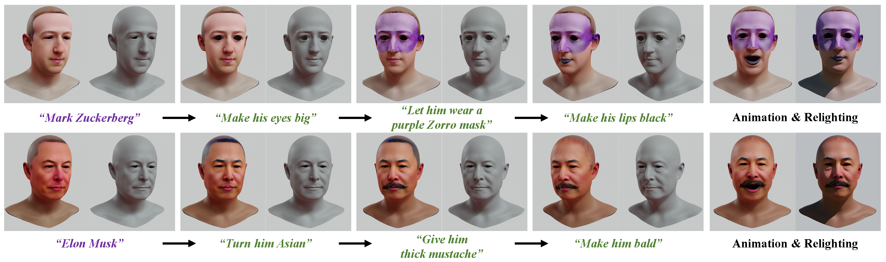

# FaceG2E
## Text-Guided 3D Face Synthesis - From Generation to Editing
## [Project page](https://FaceG2E.github.io) | [Paper](https://arxiv.org/abs/tbu)

Text-guided 3D face synthesis has achieved remarkable results by leveraging text-to-image (T2I) diffusion models. However, most existing works focus solely on the direct generation, ignoring the editing of the faces, restricting them from synthesizing customized 3D faces through iterative editing. In this paper, we propose a unified text-guided framework from face generation to editing. In the generation stage, we propose a geometry-texture decoupled generation to mitigate the loss of geometric details caused by coupling. Besides, decoupling enables us to utilize the generated geometry as a condition for texture generation, yielding highly geometry-texture aligned results. We further employ a fine-tuned texture diffusion model to enhance texture quality in both RGB and YUV space. In the editing stage, we first employ a pre-trained diffusion model to update facial geometry or texture based on the texts. To enable sequential editing, we introduce a UV domain consistency preservation regularization, preventing unintentional changes to irrelevant facial attributes. Besides, we propose a self-guided consistency weight strategy to improve editing efficacy while preserving consistency. Through comprehensive experiments and comparisons with existing methods, we showcase our method's superiority in face synthesis.

    </a>

